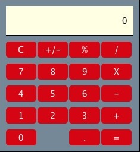

# calculator

A simple calculator built in HTML, CSS, and vanilla JS. Its main features are:

- Basic arithmetic operations (+, -, X, /), percentage conversions, and toggling +/-
- Calcuations performed on equals and sequential operations e.g. 3 \* 2 + 4 shows 6 and then 10 on the display
- User input accepted via front-end clicks or via keyboard

Use this [jsfiddle](https://jsfiddle.net/4bsaLwmj/3/) for a live demo.

